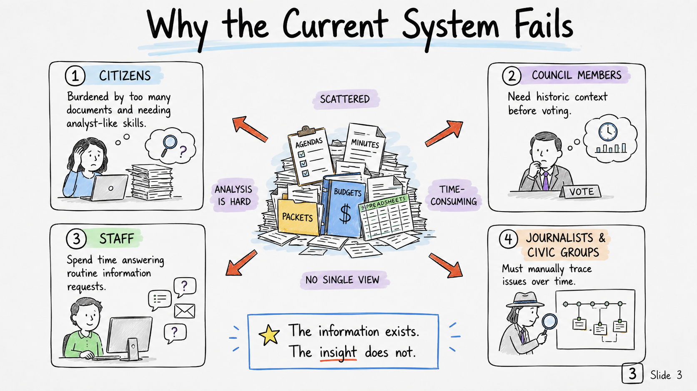
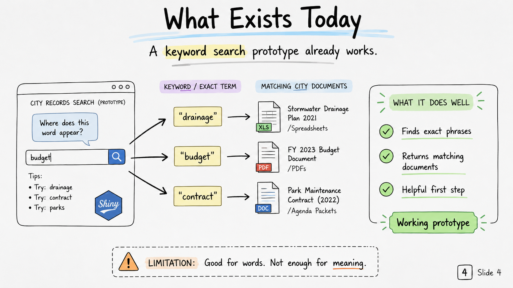
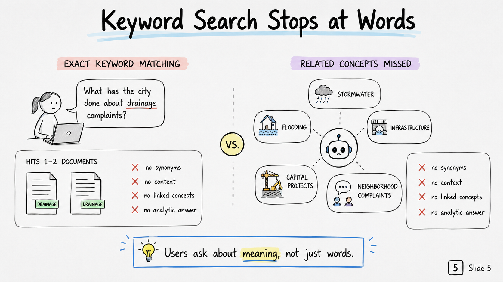
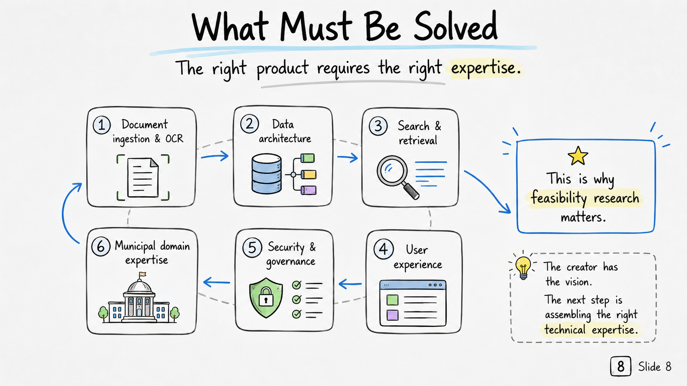
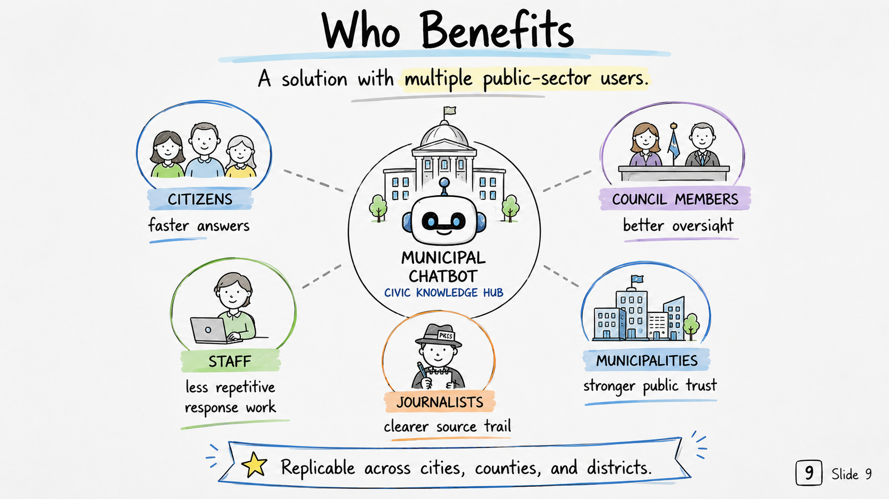
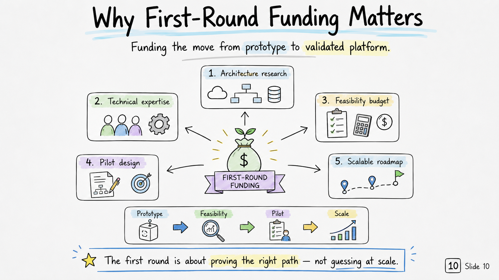

```{r}
#| label: slide-1
#| echo: false
#| out-width: "100%"
#| fig-align: "center"


```

---

```{r}
#| label: slide-2
#| echo: false
#| out-width: "100%"
#| fig-align: "center"


```

---


```{r}
#| label: slide-3
#| echo: false
#| out-width: "100%"
#| fig-align: "center"



```

---

```{r}
#| label: slide-4
#| echo: false
#| out-width: "100%"
#| fig-align: "center"



```

---


```{r}
#| label: slide-5
#| echo: false
#| out-width: "100%"
#| fig-align: "center"



```

---

```{r}
#| label: slide-6
#| echo: false
#| out-width: "100%"
#| fig-align: "center"


```

---

```{r}
#| label: slide-7
#| echo: false
#| out-width: "100%"
#| fig-align: "center"


```

---

```{r}
#| label: slide-8
#| echo: false
#| out-width: "100%"
#| fig-align: "center"



```

---

```{r}
#| label: slide-9
#| echo: false
#| out-width: "100%"
#| fig-align: "center"



```

---

```{r}
#| label: slide-10
#| echo: false
#| out-width: "100%"
#| fig-align: "center"



```

