## {.center}

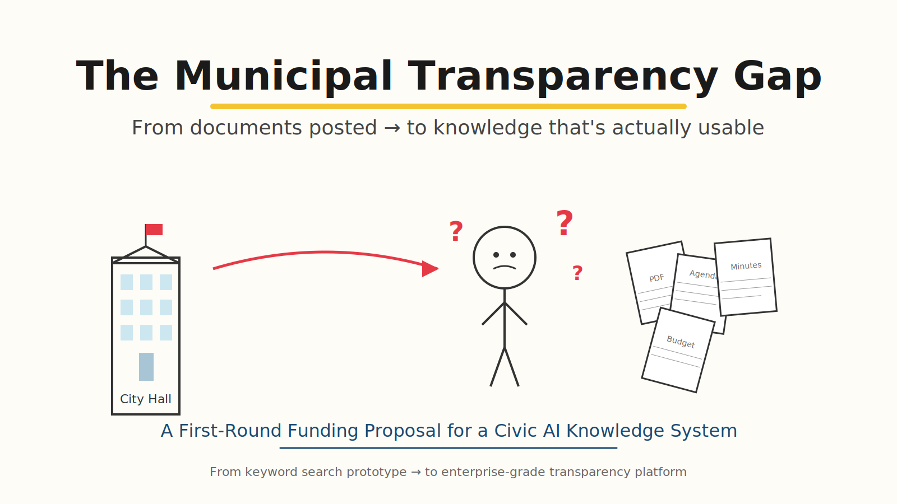{fig-align="center" width="95%"}

::: notes
Opening slide. Establish the core thesis in one sentence: this is about closing the gap
between documents being *posted* and knowledge being *usable*. Mention that a working
keyword-search prototype already exists — this is about the next step.
:::

---

## The Transparency Paradox

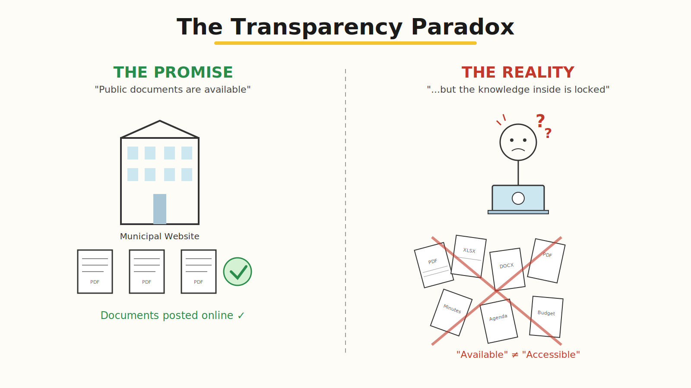{fig-align="center" width="95%"}

::: notes
Documents are technically available — but the knowledge inside them is locked behind
unstructured PDFs, inconsistent formats, and siloed archives. "Available" is not the
same as "Accessible."
:::

---

## Who Bears the Burden?

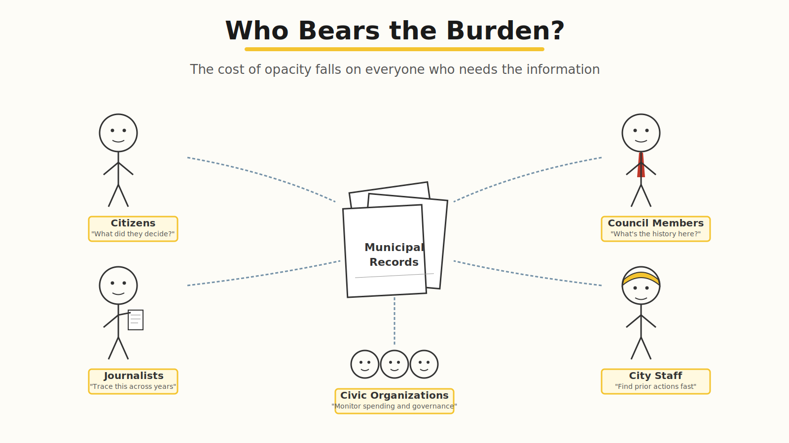{fig-align="center" width="95%"}

::: notes
Five distinct audiences all share the same pain. The cost of opacity is distributed
across citizens, council members, journalists, staff, and civic organizations.
Emphasize the breadth of users — this is not a niche product.
:::

---

## Where Keyword Search Stops

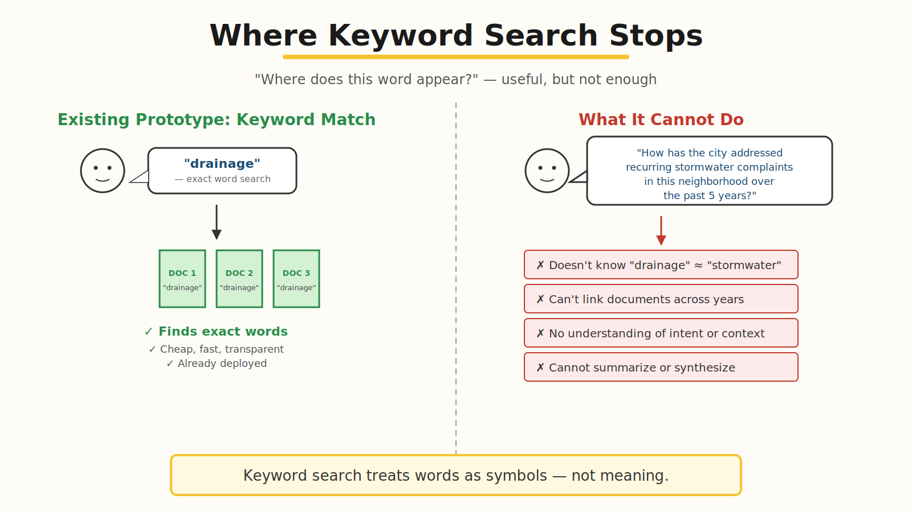{fig-align="center" width="95%"}

::: notes
Be honest about what the existing prototype does well — it works, it's cheap,
it's already deployed. Then be honest about its ceiling: keyword search treats
words as symbols, not meaning. That's the gap we need to close.
:::

---

## The Leap: From Symbols to Meaning

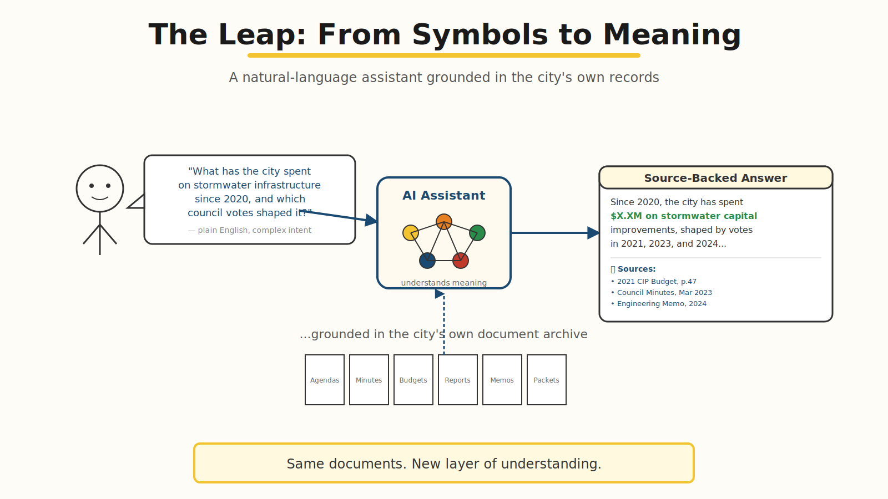{fig-align="center" width="95%"}

::: notes
This is the conceptual heart of the proposal. Same documents. New layer of
understanding. The chatbot doesn't replace official records — it makes them
queryable in plain English with verifiable citations back to source.
:::

---

## How It Works (Conceptually)

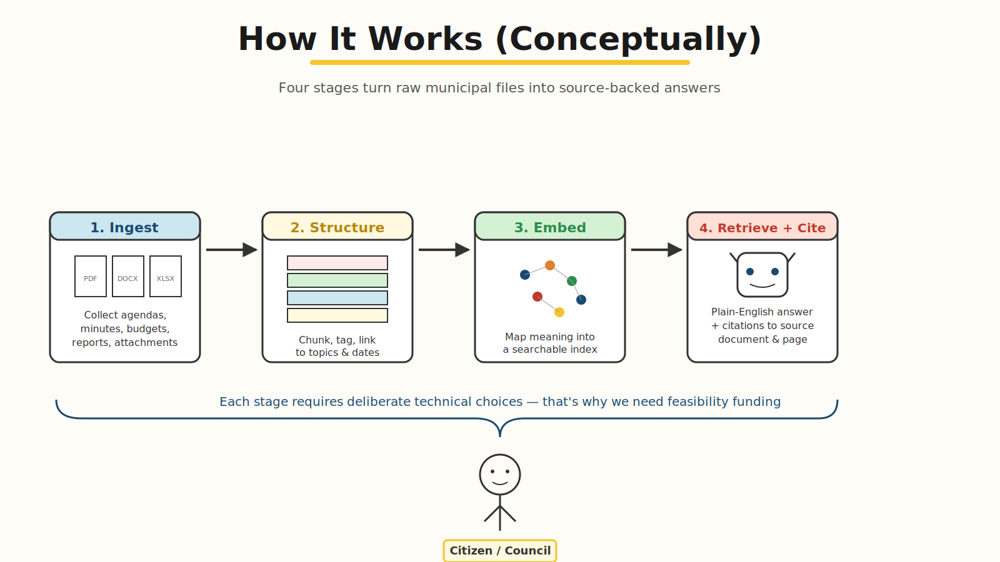{fig-align="center" width="95%"}

::: notes
Four stages: ingest, structure, embed, retrieve+cite. Each stage requires
deliberate technical choices — chunk size, embedding model, retrieval strategy,
citation format. None of these are off-the-shelf decisions for municipal data.
:::

---

## The Expertise Required

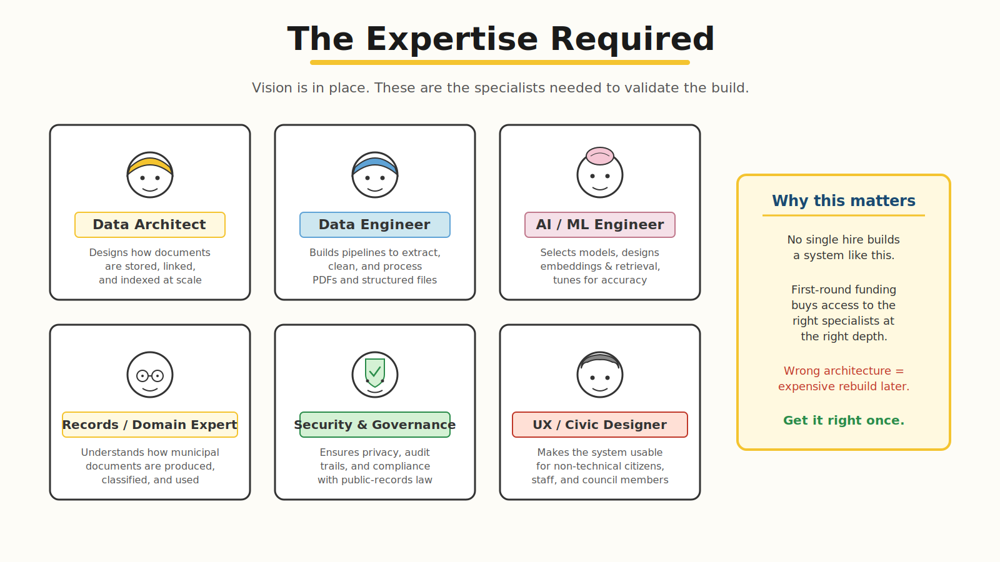{fig-align="center" width="95%"}

::: notes
Six specialist roles. No single hire builds this system. First-round funding
buys access to the right specialists at the right depth. The risk of skipping
this step is the wrong architecture — and an expensive rebuild later.
:::

---

## Open Technical Questions

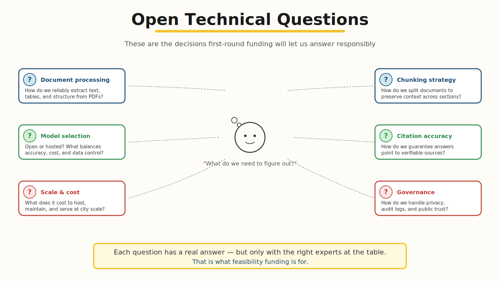{fig-align="center" width="95%"}

::: notes
These are the real, unresolved questions. Document processing, chunking,
model selection, citation accuracy, cost at scale, governance. Each has
a real answer — but only with the right experts at the table.
:::

---

## What First-Round Funding Buys

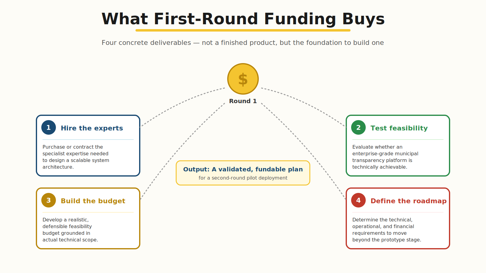{fig-align="center" width="95%"}

::: notes
Four concrete deliverables, not a finished product: experts hired, feasibility
tested, budget built, roadmap defined. The output of Round 1 is a validated,
fundable plan for a second-round pilot — not vaporware promises.
:::

---

## What a Successful Pilot Demonstrates

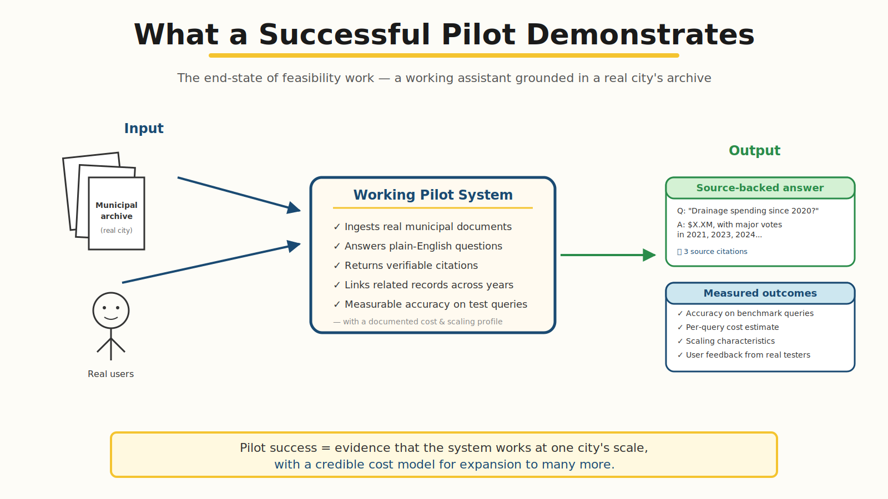{fig-align="center" width="95%"}

::: notes
A working pilot proves: real documents in, plain-English questions answered,
citations verifiable, measurable accuracy, real users, real cost data.
This is the bridge from feasibility to scale.
:::

---

## A Widespread Public-Sector Need

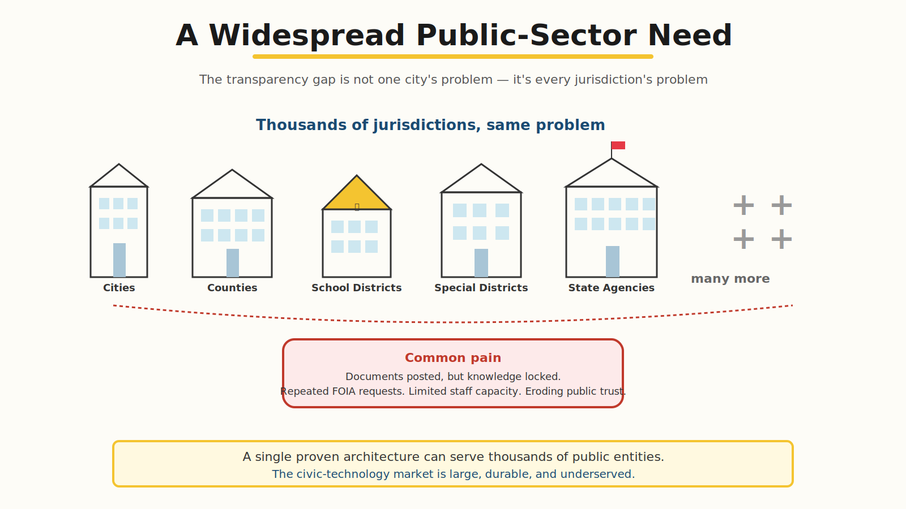{fig-align="center" width="95%"}

::: notes
Same architecture, many entities. Cities, counties, school districts,
special districts, state agencies — all face the same transparency gap.
The civic-technology market is large, durable, and underserved.
:::

---

## The Ask

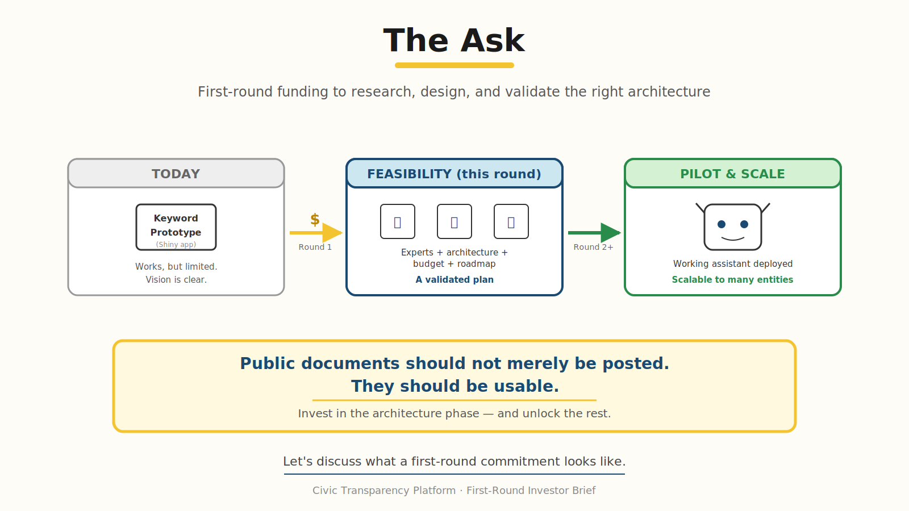{fig-align="center" width="95%"}

::: notes
Close with the core message: public documents should not merely be posted —
they should be usable. Invest in the architecture phase. Round 1 is the
smallest amount of capital that produces the answer of whether to do this
at scale at all.
:::
